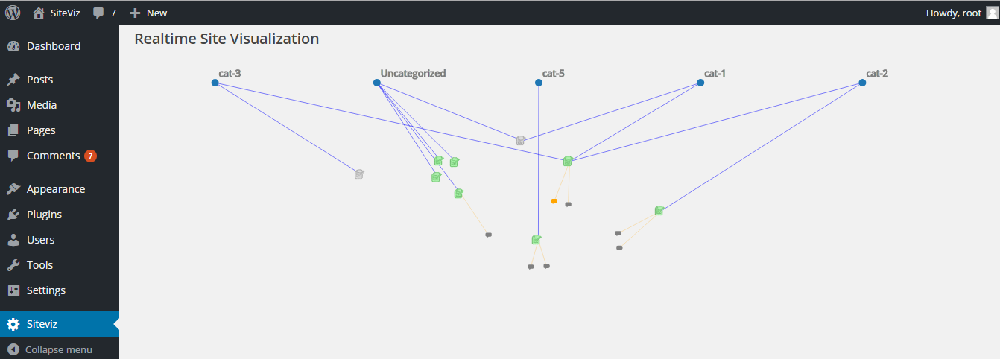

# Wordpress Site Visualization (SiteViz Plugin)

This is a wordpress plugin which visualizes the site content stucture in the form of a force directed graph. Once installed, it can portray the categories , posts and comments added to the ste and can reveal the association between them to provide a bird's eye view to the administrator. 

## Features
1. This plugin can visualize the categories and posts added by various contributors to the site. It can also visualize the comments added by site visitors. 
2. It provides visual indication of the state of posts and comments. Posts in 'draft' , 'pending' or 'published' states are rendered with different colors for clear and easy identification. Similarly comments in 'approved' and 'unapproved' states are also marked with separate colors. 
3. It also captures the popularity of the posts. Posts that are more popular appear with bigger icons compared to posts which are not so popular.
4. Plugin can update itself in realtime, based on the on going site activity. For example, if a new post is added, modified or deleted by admin, or a new comment is posted by a site visitor, these changes reflect on the visualization instantly. 

## Install and Configure

      WARNING : This is a demo plugin only for trial and educational purposes. It is strictly
      advised not to install it in a production Wordpress site as it is not tested for performance
      and security loopholes.  

Before installing the plugin, make sure that you have a PubNub subscription. PubNub enables the realtime updates on the plugin visualization. Refer [PubNub website](http://www.pubnub.com) to get your free subscription.

Follow the steps below to install and configure the plugin.

1. Create a new wordpress site installation using the latest package available in wordpress.org. ( This plugin is tested on Wordpress 4.5.3)
2. Clone this repository and copy the contents of plugin [root folder](wordpress/wp-content/plugins/) to your site's wp-content/plugins folder.
3. Go to your site admin dashboard and access the Plugins menu. You can see this plugin listed there with the name 'SiteViz'.
4. Follow the routine wordpress procedure to install and activate the SiteViz plugin. 
5. Once activated, access the Settings menu and under that you can access the SiteViz submenu. In the SiteViz setting UI, enter your PubNub subscribe and publish key that you would have received once you created your PubNub account. Press Submit to registed the settings.

## Usage

1. Once the SiteViz plugin is installed, go ahead and create a few categories and posts. You can also access the site home page and post a few comments.
2. Open the wordpress dashboard and access the 'SiteViz' menu at the bottom. 
3. Once the page refreshes, you will be able to see a visualization of your site content as per the categories, posts and comments added by you in step 1.
4. Keep the visualization open in one browser window, and add some more posts / comments from another window. You will see that the visualization will get updated in realtime to display the newly added posts/comments. 
5. You can try few other operations like , changing state of post, comments or changing the content or categories of the posts. All this will reflect in the visualization. 

## Limitations
1. This plugin will only display categories, posts and comments in the wordpress site along with their basis info. 
2. This plugin cannot capture posts which were added before installing it.
3. Realtime updates for comment and category deletion is not supported. Similarly, secondary means of performing operations through bulk actions or through dropdown menus is not supported.
4. All times are in UTC.

